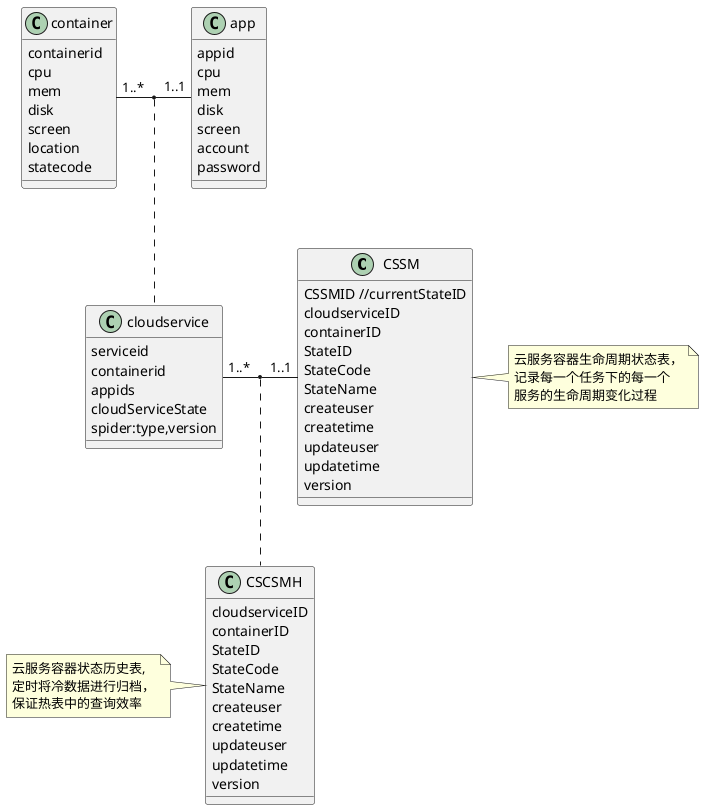

# 云服务管理系统 详细设计
```plantumlcode

```
## 模块设计
> 云服务管理系统的核心功能，是对云服务的申请和释放。  
在处理申请和释放的过程中，都要根据当前云服务的状态，和云平台、封禁系统进行接口调用。
>  
```plantuml
@startuml
scale 800 height
skinparam backgroundColor LightYellow

package "云服务管理系统"    { 
    HTTP - [API Component]
   [API Component] - [Service Component]
   [Service Component] - [DAO]
}
database "MySql" {
    frame "CloudService" {
        [CSSM]
        [CSCCS]
        [CSCSMH]
    }
    [DAO] --> [CSSM]
    [DAO] --> [CSCCS]
    [DAO] --> [CSCSMH]
}

note left of 注释
[CSCCS]
Cloud Service-Container Current State 
[CSSM]
Cloud Service State Machine
[CSCSMH]
Cloud Service State Machine
end note
node "封禁系统" {
[Service Component] ..> [封禁系统API Component] :use http
}
node "云平台" {
[Service Component] ..> [云平台API Component] :use http
}
@enduml

```

# 实体关系图


